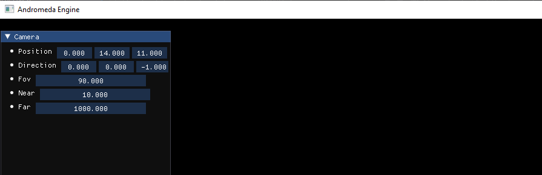
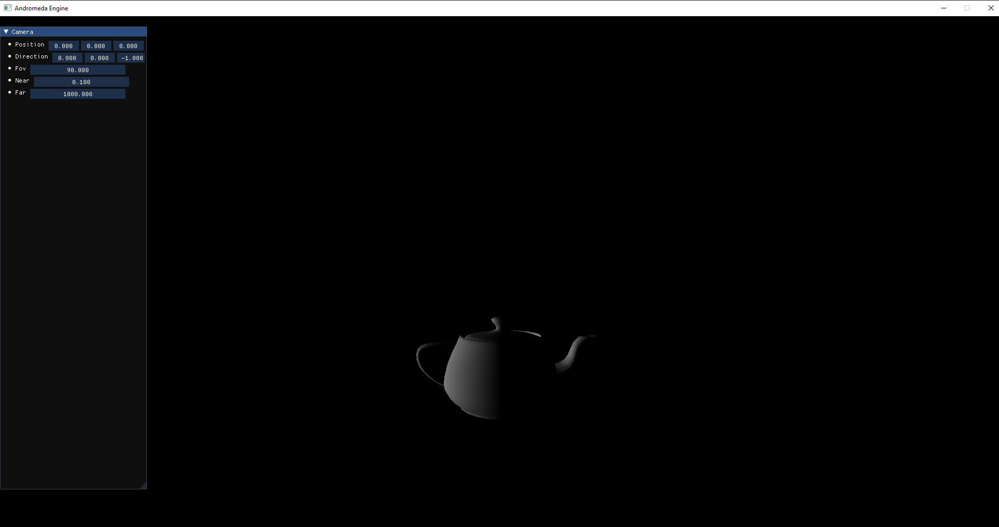
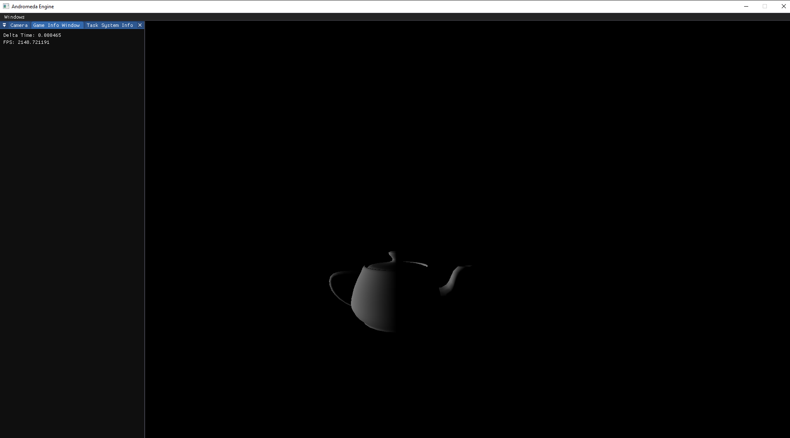
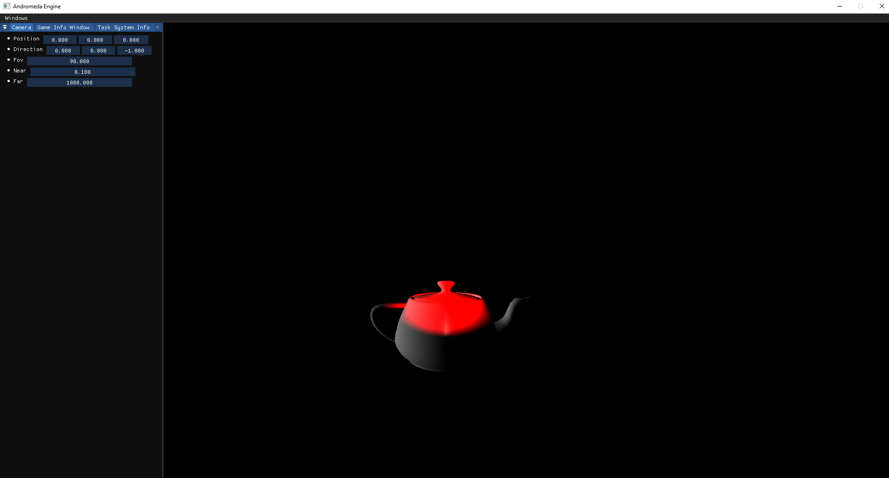
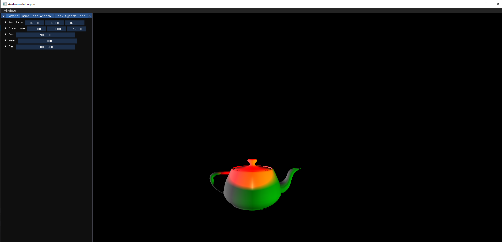
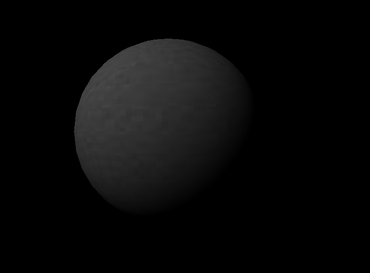
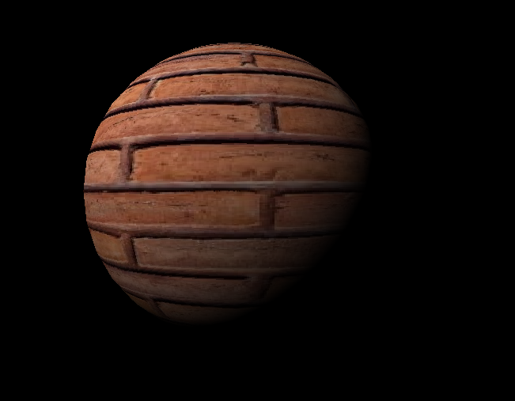

# AndromedaEngine

Graphics library made in C++ with OpenGL

__Authors__ :pencil2:
- Jose Maria Maestre
- Hector Ochando 

## :package: Dependences
- Python 3.11
- Conan < 2 
- Cmake

## :gear:  Set up instructions

``` 
cd tools
./setup.bat
```
Then follow the script instructions

Open Visual Studio solution


## :bulb: Hello World tutorial

In our main.cpp 

```C++
#include "Andromeda.h"
```

Basic engine creation
```C++
And::Engine engine;
```

Creating a Window
```C++
// Window
std::shared_ptr<And::Window> window = And::Window::make(engine, 1920, 1080, "Andromeda Engine");

// Create Renderer and Graphics Context
std::shared_ptr<And::GraphicsContext> g_context = window->get_context();
And::Renderer g_renderer(*window); 
```

In our principal loop we have to do 2 principal calls at begining and 2 at the end
```C++
while (window->is_open()){
    window->update();
    g_renderer.new_frame();
    

    g_renderer.end_frame();
    window->swap_buffers();
}
```

And we should see something like this



## :camera: Camera
Flying camera is present by default, you can move using WASD and rotate with mouse pressing right click

## :bust_in_silhouette: How to draw a OBJ

First, we have to create the __Entity Component System__ to manage all scene entities and create or modify

```C++
// Create
And::EntityComponentSystem entity_comp;

// Add basic components
And::AddBasicComponents(entity_comp);
```

- Create Mesh Component
```C++
And::MeshComponent MC;
MC.MeshOBJ = And::Geometry::load("teapot.obj");
```

- Create __Transform__ component to manage *position*, *scale* and *rotation* of the entity
```C++
And::TransformComponent tran;
tran.position[0] = 0.0f;
tran.position[1] = -4.0f;
tran.position[2] = -10.0f;
tran.rotation[0] = 1.0f;
tran.rotation[1] = 1.0f;
tran.rotation[2] = 1.0f;
tran.scale[0] = 1.0f;
tran.scale[1] = 1.0f;
tran.scale[2] = 1.0f;
```
- Add obj to the entity list
```C++
And::Entity* obj_id = entity_comp.new_entity(MC, tran);
```

__Note:__ You should save the entity returned by the entity component system to modify his values in the future

Now we can render the object in the scene but we have to add a light before in order to being able to see that object

- Add __Directional light__

```C++
And::DirectionalLight directional{};
directional.SetDirection(1.0f, 0.0f, 0.0f);
directional.SetDiffuseColor(1.0f, 1.0f, 1.0f);
directional.SetSpecularColor(1.0f, 1.0f, 1.0f);
directional.SetEnabled(true);
```

- Add directional light to entity list
```C++
And::Entity* light_directional_entity = entity_comp.new_entity(directional);
```

- __Render__ the scene

```C++
// Between new_frame() and end_frame()
And::DrawForward(entity_comp, g_renderer);
```

And now we should see something like this



## :framed_picture: Floating windows

You can change the floating windows were ever you want, similar to visual studio. You have to create the __Editor Window__ with the  __Resource Manager__ for that with system information

```C++
And::ResourceManager r_manager{*window, ts};
And::Editor editor{*window, &r_manager};
editor.AddWindow(ts.GetEditorWindow());
```

In your main loop:
```C++
// Before rendering the scene
editor.ShowWindows();
```

You should see the *task system* window and *permormance window*. Change the order however you like pressing mouse button on window label and drop it


## :high_brightness: Multiple lights
You can create *Directional light*, *Point light* or *Spot light*, the creation process is the same as Directional light

- Spot Light :flashlight:
```C++
And::SpotLight spot{};
spot.SetEnabled(true);
spot.SetPosition(0.0f, 0.0f, 0.0f);
spot.SetDirection(0.0f, 0.0f, -1.0f);
spot.SetDiffuseColor(1.0f, 0.0f, 0.0f);
spot.SetSpecularColor(1.0f, 1.0f, 1.0f);
spot.SetSpecularStrength(0.003f);
spot.SetSpecularShininess(8.0f);
spot.SetConstantAtt(1.0);
spot.SetLinearAtt(0.014f);
spot.SetQuadraticAtt(0.0007f);
spot.SetCuttOff(2.5f);
spot.SetOuterCuttOff(17.5f);
entity_comp.new_entity(spot);
```


- Point Light :bulb:
```C++
And::PointLight point{};
point.SetEnabled(1.0f);
point.SetPosition(14.0f, -4.0f, 4.0f);
point.SetDiffuseColor(0.0f, 1.0f, 0.0f);
point.SetSpecularStrength(0.003f);
point.SetSpecularColor(1.0f, 1.0f, 1.0f);
point.SetSpecularShininess(8.0f);
point.SetConstantAtt(1.0f);
point.SetLinearAtt(0.014f);
point.SetQuadraticAtt(0.0007f);
And::Entity* point_entity = entity_comp.new_entity(point);
```



## :city_sunset: Shadows

To make shadows with a light you have to enable *Cast Shadows* value in a light
```C++
directional.SetCastShadows(true);
spot.SetCastShadows(true);
point.SetCastShadows(true);
```

## :art: Textures

Add texture to a Geometry

You must have a default texture in your obj



You can set your own texture creating a Texture object and setting to the Mesh
```C++
And::MeshComponent MC;
MC.MeshOBJ = And::Geometry::load("sphere.obj");
std::shared_ptr<And::Texture> texture = And::MakeTexture("bricks.jpg");
MC.MeshOBJ->SetTexture(texture);
```


## Input :joystick:
To detect keyboard input you must create an Input object

```C++
And::Input input{*window};
```

In your principal loop you must detect the desired input
```C++
if (input.IsKeyDown(And::KeyCode::W)){
    printf("W Pressed!\n");
}
```

Also you can create Action Input and attach keyboard key or multiple keys
```C++
And::ActionInput jump{"Jump", And::KeyState::Press, { And::KeyCode::Space, And::KeyCode::J }};
``` 

In your principal loop
```C++
if(input.check_action(jump)){
    printf("Jump!\n");
}
```

To get mouse position you can get X and Y at same time using
```C++
double mouse_x, mouse_y;
input.GetMousePosition(&mouse_x, &mouse_y);
```

Or get individual positions using
```C++
double mouse_x, mouse_y;
mouse_x = input.GetMouseX();
mouse_y = input.GetMouseY();
```


# Advanced features

## 💾 Save struct in disk

You are able to save structs in disk in a simple way and load after or in other runtime

```C++
// Create a SavedObject object
And::SavedObject save_object{};

// Define a struct to save
struct ExampleStruct{
    int a;
    float b;
    char c;
};

// Creating a simple object
ExampleStruct test_save;
test_save.a = 3;
test_save.b = 3.3f;
test_save.c = 'F';

// Save struct, return true if ok, false if something went wrong
bool result = save_object.save<ExampleStruct>("test", test_save);

// Load struct from disk
ExampleStruct prueba;
save_object.load<ExampleStruct>("test", prueba); 
```